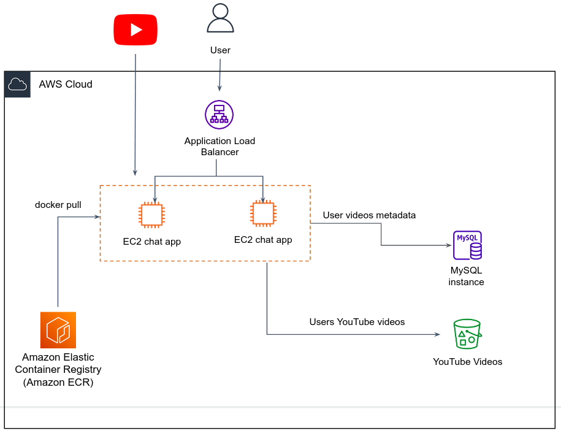

# AWS tutorials

Throughout this tutorial, we will deploy the YouTube app from the previous class in AWS cloud. Slowly, buy surely, we will upgrade the app to fit modern application architecture, i.e. being highly available, scalable and fault tolerant.

In the first phase, we will deploy a monolithic app on a single EC2 instance. The app stores the downloaded YouTube videos in S3, and users videos in MySQL database managed by RDS.


## Launch an Ubuntu EC2 instance

1. Open the Amazon EC2 console at [https://console\.aws\.amazon\.com/ec2/](https://console.aws.amazon.com/ec2/).

1. From the EC2 console dashboard, in the **Launch instance** box, choose **Launch instance**, and then choose **Launch instance** from the options that appear\.

1. Under **Name and tags**, for **Name**, enter a descriptive name for your instance (that can be identifiable by the group)\.

1. Under **Application and OS Images \(Amazon Machine Image\)**, do the following:

    1. Choose **Quick Start**, and then choose Windows\. This is the operating system \(OS\) for your instance\.

    1. From **Amazon Machine Image \(AMI\)**, select the `iec-architecture-22-linux` in MyAMIs.

1. Under **Instance type**, from the **Instance type** list, Choose the `t2.medium` instance type (or equivalent `medium` machine).

1. Under **Key pair \(login\)**, for **Key pair name**, choose the key pair that you created, or create a new one.

1. Keep the default selections for the other configuration settings for your instance\.

1. Review a summary of your instance configuration in the **Summary** panel, and when you're ready, choose **Launch instance**\.

1. On the **Instances** console page, you can view the status of the launch\. It takes a short time for an instance to launch\. When you launch an instance, its initial state is `pending`\. After the instance starts, its state changes to `running` and it receives a public DNS name\.

1. It can take a few minutes for the instance to be ready for you to connect to it\. Check that your instance has passed its status checks; you can view this information in the **Status check** column\.

#### Connect to your instance

1. In the navigation pane, select **Instances**\. Select the instance and then choose **Connect**\.
2. On the **Connect to instance** page, choose the **SSH client** tab.
3. Copy the **Example:** command at the bottom of the page, the command should seem like:
```shell
ssh -i "your-key.pem" ec2-user@your-machine-hostname
```
4. Run the command from a PowerShell or Bash Terminal from a path where your `.pem` private key file is located.
5. Upon success, you should gain Terminal access to your machine. 


#### Install Docker in your instance (only if needed. In your machine Docker is already installed)

1. Update the installed packages and package cache on your instance.
```shell
sudo yum update -y
```
2. Install the most recent Docker Engine package.
```shell
sudo amazon-linux-extras install docker
```
3. Start the Docker service.
```shell
sudo service docker start
```
4. To ensure that the Docker daemon starts after each system reboot, run the following command:
```shell
sudo systemctl enable docker
```
5. Add the `ec2-user` to the `docker` group so you can execute Docker commands without using `sudo`.
```shell
sudo usermod -a -G docker ec2-user
```
6. Log out and log back in again

## Save data in S3

We would like all out app to store all downloaded YouTube videos in S3 bucket.

#### Create S3 bucket

1. Sign in to the AWS Management Console and open the Amazon S3 console at [https://console.aws.amazon.com/s3/](https://console.aws.amazon.com/s3).

2. Choose **Create bucket**.

   The **Create bucket** wizard opens.

3. In **Bucket name**, enter a DNS-compliant name for your bucket.

   The bucket name must:
    + Be unique across all of Amazon S3.
    + Be between 3 and 63 characters long.
    + Not contain uppercase characters.
    + Start with a lowercase letter or number.

4. In **Region**, choose the AWS Region where you want the bucket to reside.

   Choose the Region where you provisioned your EC2 instance.

5. Under **Object Ownership**, leave ACLs disabled.

7. Enable Default encryption with SSE-S3 encryption type.

6. Choose **Create bucket**.

## Create MySQL database with RDS

1. Open the Amazon RDS console at [https://console\.aws\.amazon\.com/rds/](https://console.aws.amazon.com/rds/).

2. In the navigation pane, choose **Databases**\.

3. Choose **Create database** and make sure that **Standard create** is chosen\.

4. In **Configuration**, choose **MySQL**\, choose the same version of MySQL as we used in the Docker image (`5.7`).

5. For **DB instance size**, choose **Free Tier**.

6. For **DB instance identifier**, enter a unique name for the DB instance.

7. For **Master username**, type **root**.

8. Enter **secret1234** as the master password.

9. Choose a DB instance according to your needs (**the smallest**).
10. Under **Connectivity**, **Public access** choose **Yes**.
11. In **VPC security group (firewall)** choose **Create new** and enter a security group name for your DB.
12. In **Additional configuration** enter "videos" in **Initial database name**.
13. Choose **Create database**\.

## Run the Docker app in EC2

So we have an EC2 with Docker installed, S3 bucket ready to store videos, and MySQL RDS for videos metadata.
We would like now to run the YouTube chat application and see how the system works. 

1. On your local machine (or working VM) build the application located in `app-cloud-monolith` directory. Push the image to an ECR registry (create one if needed).
2. From your EC2 instance, pull your app image by:
```shell
docker pull public.ecr.aws/n5h8m9x0/app-cloud-monolith:0.0.1
```
3. Run the container by:
```shell
docker run -p 80:8080 -e SQL_HOST=<sql-endpoint> -e BUCKET_NAME=<bucket-name> <image-name>
```

Does your app work? sure no... your EC2 hasn't permissions to talk with ECR and S3! 

#### Attached an AWS IAM role to your EC2 instance

1. Open the Amazon EC2 console at [https://console\.aws\.amazon\.com/ec2/](https://console.aws.amazon.com/ec2/).

1. In the navigation pane, choose **Instances**\.

1. Select the instance, choose **Actions**, **Security**, **Modify IAM role**\.

1. Select `arn:aws:iam::700935310038:role/app-cloud-role` as the IAM role to attach to your instance, and choose **Save**\.


Does your app work? sure no... your EC2 security group doesn't allow traffic on port 8080!

#### Authorize inbound HTTP traffic for your instance

**To add a rule to a security group for inbound HTTP traffic over IPv4**

1. Select your instance and, in bottom half of the screen, choose the **Security** tab\. **Security groups** lists the security groups that are associated with the instance\. **Inbound rules** displays a list of the inbound rules that are in effect for the instance\.

2. For the security group to which you'll add the new rule, choose the security group ID link to open the security group\.

3. On the **Inbound rules** tab, choose **Edit inbound rules**\.

4. On the **Edit inbound rules** page, do the following:

5. Choose **Add rule**\.

6. For **Type**, choose **HTTP**\.

7. For **Source**, choose **0.0.0.0/0**. [Read more](https://en.wikipedia.org/wiki/Classless_Inter-Domain_Routing) about CIDR notation.

8. Choose **Save rules**\.


---

So far we've deployed a monolithic app utilizing AWS storage and compute resource. 
We would like now to turn the app to be highly available and redundant. 
In this phase you will add a Load Balancer such that incoming requests will be spread across multiple EC2 instances.



## Create Application Load Balancer

### Configure a target group

Configuring a target group allows you to register targets such as EC2 instances\.

1. Open the Amazon EC2 console at [https://console\.aws\.amazon\.com/ec2/](https://console.aws.amazon.com/ec2/)\.

2. In the left navigation pane, under **Load Balancing**, choose **Target Groups**\.

3. Choose **Create target group**\.

4. In the **Basic configuration** section, set the following parameters:

   1. For **Choose a target type**, select **Instance** to specify targets by instance ID

   2. For **Target group name**, enter a name for the target group\.

   3. Leave the **Port** and **Protocol** as HTTP 80.

   4. For VPC, select your virtual private cloud \(VPC\)

   5. For **Protocol version**, select **HTTP1**.

5. In the **Health checks** section, modify the default settings as needed to perform a health checks to the **youtubeBot** webserver at endpoint `/status` ([youtubeBot](../youtubeBot/index.js))\.

6. Choose **Next**\.
7. In the **Register targets** page, add one or more targets by selecting one or more instances, enter one or more ports, and then choose **Include as pending below**\.
8. Choose **Create target group**\.

### Configure a load balancer and a listener

To create an Application Load Balancer, you must first provide basic configuration information for your load balancer, such as a name, scheme, and IP address type\.
Then, you provide information about your network, and one or more listeners\.
A listener is a process that checks for connection requests\. It is configured with a protocol and a port for connections from clients to the load balancer\.

1. In the navigation pane, under **Load Balancing**, choose **Load Balancers**\.

2. Choose **Create Load Balancer**\.

3. Under **Application Load Balancer**, choose **Create**\.

4. **Basic configuration**

   1. For **Load balancer name**, enter a name for your load balancer\.

   2. For **Scheme**, choose **Internet\-facing**.
      An internet\-facing load balancer routes requests from clients to targets over the internet\.

   3. For **IP address type**, choose **IPv4**.

5. **Network mapping**

   1. For **VPC**, select the VPC that you used for your EC2 instances\. As you selected **Internet\-facing** for **Scheme**, only VPCs with an internet gateway are available for selection\.

   1. For **Mappings**, select two or more Availability Zones and corresponding subnets\. Enabling multiple Availability Zones increases the fault tolerance of your applications\.

6. For **Security groups**, select an existing security group, or create a new one\.

   The security group for your load balancer must allow it to communicate with registered targets on both the listener port and the health check port\. The console can create a security group for your load balancer on your behalf with rules that allow this communication\. You can also create a security group and select it instead\. See [recommended rules](https://docs.aws.amazon.com/elasticloadbalancing/latest/application/load-balancer-update-security-groups.html#security-group-recommended-rules)

7. For Listeners and routing, the default listener accepts HTTP traffic on port 80. Choose different ones port according to your app. For Default action, choose the target group that you created.
9. Review your configuration, and choose **Create load balancer**\. A few default attributes are applied to your load balancer during creation\. You can view and edit them after creating the load balancer\. For more information, see [Load balancer attributes](https://docs.aws.amazon.com/elasticloadbalancing/latest/application/application-load-balancers.html#load-balancer-attributes)\.


### Test the load balancer

Deploy another EC2 instances of your cloud-app-monolith, in each instance.


## Re-design app architecture for async jobs using SQS

We would like now to split the app into different microservices. 

We will re-design our app in a microservices architectural style.
The Web chat service will receive requests from clients, it produces a message to an SQS queue and immediately responds to the client.
The Worker service will consume the messages from the queue and do the "hard job" of downloading the video and upload to S3.


#### Create a standard SQS queue

1. Open the Amazon SQS console at [https://console\.aws\.amazon\.com/sqs/](https://console.aws.amazon.com/sqs/)\.

2. Choose **Create queue**\.

3. For **Type**, choose **Standard** queue type.

4. Enter a **Name** for your queue\.

5. The console sets default values for the queue [configuration parameters](https://docs.aws.amazon.com/AWSSimpleQueueService/latest/SQSDeveloperGuide/sqs-configure-queue-parameters.html). Under **Configuration**, you can set new values for the following parameters.

6. Define an **Access policy**\. The [access policy](https://docs.aws.amazon.com/AWSSimpleQueueService/latest/SQSDeveloperGuide/sqs-creating-custom-policies-access-policy-examples.html) defines the accounts, users, and roles that can access the queue (we will stay with the default configurations)

7. Choose **Create queue**\. Amazon SQS creates the queue and displays the queue's **Details** page\.

#### Run the microservices

1. From your EC2 instance, pull the Webserver app image by:
```shell
docker pull public.ecr.aws/n5h8m9x0/app-cloud-microservices-webserver:0.0.1
```
2. Run the container by:
```shell
docker run -p 80:8080 -e SQL_HOST=<sql-endpoint> -e AWS_REGION=<region-code> -e QUEUE_NAME=<your-queue-name> <image-name>
```

3. From other machine (or from the same machine for the demo purposes), pull the Worker app image by:
```shell
docker pull public.ecr.aws/n5h8m9x0/app-cloud-microservices-worker:0.0.1
```
2. Run the container by:
```shell
docker run -e QUEUE_NAME=<queue-name> -e BUCKET_NAME=<your-bucket-name> -e AWS_REGION=<region-code> <image-name>
```

#### Test your app